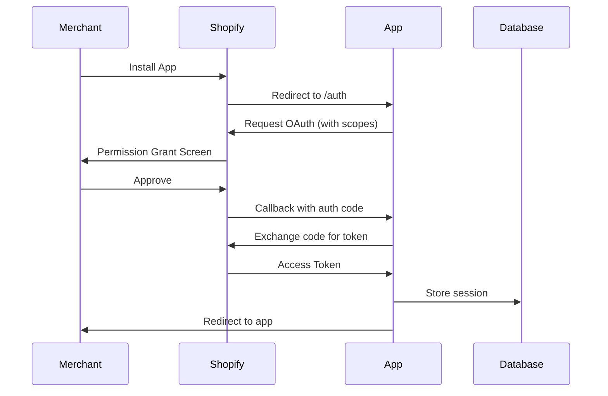

## Overview

The Ecomdrop IA Connector uses **Shopify OAuth 2.0** for authenticating merchants and accessing the Shopify Admin API. The app is configured as an AppStore distribution with session-based authentication.

## Authentication Methods

### 1. Shopify Admin Authentication

Used for all admin-facing API endpoints that manage store data.

#### Implementation

The app uses `@shopify/shopify-app-react-router` to handle OAuth automatically:

```typescript
// app/shopify.server.ts
import { shopifyApp } from "@shopify/shopify-app-react-router/server";

const shopify = shopifyApp({
  apiKey: process.env.SHOPIFY_API_KEY,
  apiSecretKey: process.env.SHOPIFY_API_SECRET,
  apiVersion: ApiVersion.October25,
  scopes: process.env.SCOPES?.split(","),
  appUrl: process.env.SHOPIFY_APP_URL,
  authPathPrefix: "/auth",
  sessionStorage: new PrismaSessionStorage(prisma),
  distribution: AppDistribution.AppStore,
});

export const authenticate = shopify.authenticate;
```

#### Usage in Routes

All admin API routes authenticate using the `authenticate.admin()` method:

```typescript
// app/routes/api.shopify.products.tsx
export const loader = async ({ request }: LoaderFunctionArgs) => {
  const { session, admin } = await authenticate.admin(request);

  if (!session?.shop) {
    return new Response(JSON.stringify({ error: "No shop session found" }), {
      status: 401,
      headers: { "Content-Type": "application/json" }
    });
  }

  // Use admin.graphql() to make authenticated requests
  const response = await admin.graphql(`...`);
  // ...
};
```

#### Session Object

The authenticated session contains:

```typescript
{
  id: string,              // Session ID
  shop: string,            // Store domain (e.g., "store.myshopify.com")
  state: string,           // OAuth state parameter
  isOnline: boolean,       // Online vs offline session
  scope: string,           // Granted scopes
  accessToken: string,     // API access token
  expires?: Date,          // Token expiration (online sessions)
}
```

#### Admin Client

The `admin` object provides GraphQL and REST API access:

```typescript
// GraphQL queries/mutations
const response = await admin.graphql(
  `#graphql
    query getProducts {
      products(first: 250) {
        edges {
          node {
            id
            title
          }
        }
      }
    }
  `
);

const data = await response.json();
```

<Note>
  The app uses **offline access tokens** which don't expire, allowing background operations like webhook processing.
</Note>

### 2. Webhook Authentication

Shopify webhooks are authenticated using HMAC validation built into the SDK.

```typescript
// app/routes/webhooks.orders.create.tsx
export const action = async ({ request }: ActionFunctionArgs) => {
  const { shop, session, topic, payload } = await authenticate.webhook(request);
  
  console.log(`Received ${topic} webhook for ${shop}`);
  
  // Shopify has already validated the HMAC signature
  // Process the webhook payload safely
  const order = payload.order;
  // ...
};
```

#### Webhook Security

<Warning>
  **Never process unauthenticated webhook data.** Always use `authenticate.webhook()` which validates the `X-Shopify-Hmac-SHA256` header.
</Warning>

The SDK automatically:
- Validates HMAC signature
- Verifies the webhook came from Shopify
- Extracts shop domain from headers
- Loads the shop's session

### 3. External API Key Authentication

For callback endpoints that external services call (like Ecomdrop), the app uses API key authentication.

```typescript
// app/routes/api.ecomdrop.callback.tsx
export const action = async ({ request }: ActionFunctionArgs) => {
  const body = await request.json();
  
  // Extract API key from request
  const apiKey = body.apiKey || body.api_key || body.token;
  
  if (!apiKey) {
    return new Response(
      JSON.stringify({ error: "API key is required" }),
      { status: 401 }
    );
  }
  
  // Validate against stored configuration
  const configuration = await db.shopConfiguration.findFirst({
    where: { ecomdropApiKey: apiKey }
  });
  
  if (!configuration) {
    return new Response(
      JSON.stringify({ error: "Invalid API key" }),
      { status: 401 }
    );
  }
  
  // Load shop session for API calls
  const shop = body.shop || configuration.shop;
  const sessionId = `offline_${shop}`;
  const session = await sessionStorage.loadSession(sessionId);
  // ...
};
```

<Warning>
  **Callback endpoints must be publicly accessible** but secured with API key validation to prevent unauthorized access.
</Warning>

## OAuth Flow

### Installation Flow



### Required Scopes

The app requests the following Shopify API scopes:

```env
SCOPES=read_products,write_products,read_orders,write_orders,read_customers
```

| Scope | Purpose |
|-------|---------|
| `read_products` | Fetch product catalog for synchronization |
| `write_products` | Update products with Dropi data |
| `read_orders` | Access order data for Ecomdrop workflows |
| `write_orders` | Update order tags after processing |
| `read_customers` | Access customer info in order webhooks |

<Note>
  **Protected Customer Data**: Accessing customer information requires Shopify's approval. Development apps will see `ACCESS_DENIED` errors until the app is published and approved.
</Note>

### Session Storage

Sessions are persisted in PostgreSQL using Prisma:

```typescript
// app/shopify.server.ts
import { PrismaSessionStorage } from "@shopify/shopify-app-session-storage-prisma";
import prisma from "./db.server";

sessionStorage: new PrismaSessionStorage(prisma)
```

The `Session` table schema:

```prisma
model Session {
  id          String    @id
  shop        String
  state       String
  isOnline    Boolean   @default(false)
  scope       String?
  expires     DateTime?
  accessToken String
  userId      BigInt?
}
```

#### Session Retrieval

```typescript
import { sessionStorage } from "../shopify.server";

const sessionId = `offline_${shop}`;
const session = await sessionStorage.loadSession(sessionId);

if (!session?.accessToken) {
  throw new Error("No valid session found");
}
```

## Making Authenticated API Calls

### Using the Admin Client

The preferred method for GraphQL queries:

```typescript
const { admin } = await authenticate.admin(request);

const response = await admin.graphql(
  `#graphql
    mutation updateProduct($input: ProductInput!) {
      productUpdate(input: $input) {
        product {
          id
          title
        }
        userErrors {
          field
          message
        }
      }
    }
  `,
  {
    variables: {
      input: {
        id: "gid://shopify/Product/123",
        title: "Updated Title"
      }
    }
  }
);

const data = await response.json();
```

### Direct API Calls

For scenarios where the admin client isn't available:

```typescript
const apiVersion = "2025-10";
const endpoint = `https://${shop}/admin/api/${apiVersion}/graphql.json`;

const response = await fetch(endpoint, {
  method: "POST",
  headers: {
    "Content-Type": "application/json",
    "X-Shopify-Access-Token": session.accessToken
  },
  body: JSON.stringify({
    query: `...`,
    variables: { ... }
  })
});
```

<Warning>
  Always use the **admin client** when available. Direct fetch calls should only be used in special cases like callback endpoints.
</Warning>

## Request Signing

### Webhook HMAC Validation

Shopify signs all webhooks with HMAC-SHA256. The SDK handles validation automatically:

```typescript
// Automatic validation - no manual code needed
const { shop, payload } = await authenticate.webhook(request);
```

Manual validation (if needed):

```typescript
import crypto from "crypto";

function validateWebhook(body: string, hmacHeader: string): boolean {
  const hash = crypto
    .createHmac("sha256", process.env.SHOPIFY_API_SECRET!)
    .update(body, "utf8")
    .digest("base64");
    
  return hash === hmacHeader;
}
```

### App Bridge Token Validation

For embedded app frontend requests, Shopify App Bridge handles token exchange:

```typescript
// Frontend (React)
import { useAuthenticatedFetch } from "@shopify/app-bridge-react";

function MyComponent() {
  const fetch = useAuthenticatedFetch();
  
  // All requests automatically include session token
  const response = await fetch("/api/products");
}
```

## Security Best Practices

<Warning>
  **Environment Variables**: Never commit API keys or secrets to version control. Always use environment variables.
</Warning>

### Configuration

```env
# Required
SHOPIFY_API_KEY=your_api_key
SHOPIFY_API_SECRET=your_api_secret
SHOPIFY_APP_URL=https://your-app-domain.com
SCOPES=read_products,write_products,read_orders,write_orders

# Optional
SHOP_CUSTOM_DOMAIN=custom.domain.com
```

### Validate All Input

```typescript
// Always validate external input
const apiKey = body.apiKey;
if (!apiKey || typeof apiKey !== "string") {
  return new Response(
    JSON.stringify({ error: "Invalid API key format" }),
    { status: 400 }
  );
}
```

### Use Session Validation

```typescript
// Check session before processing
if (!session?.shop) {
  return new Response(
    JSON.stringify({ error: "No shop session found" }),
    { status: 401 }
  );
}

// Verify shop matches expected shop
if (session.shop !== expectedShop) {
  return new Response(
    JSON.stringify({ error: "Shop mismatch" }),
    { status: 403 }
  );
}
```

### Secure Callback URLs

```typescript
// Whitelist allowed callback origins
const ALLOWED_ORIGINS = [
  "https://panel.ecomdrop.app",
  "https://api.dropi.co"
];

const origin = request.headers.get("origin");
if (origin && !ALLOWED_ORIGINS.includes(origin)) {
  return new Response(
    JSON.stringify({ error: "Invalid origin" }),
    { status: 403 }
  );
}
```

### Token Storage

<Warning>
  **Never expose access tokens in API responses** or client-side code. Store them securely in the database and only use them server-side.
</Warning>

## Error Handling

### Common Authentication Errors

| Error | Cause | Solution |
|-------|-------|----------|
| `No shop session found` | Missing or expired session | Re-authenticate via OAuth |
| `Invalid API key` | Wrong Ecomdrop API key | Update configuration |
| `ACCESS_DENIED` | App not approved for protected data | Publish app and request Shopify approval |
| `Unauthorized` | Missing authentication header | Include session token or API key |
| `Forbidden` | Valid auth but wrong permissions | Check OAuth scopes |

### Session Recovery

```typescript
// Handle expired sessions gracefully
try {
  const { session, admin } = await authenticate.admin(request);
  // ...
} catch (error) {
  if (error.message.includes("session")) {
    // Redirect to re-authenticate
    return redirect("/auth/login");
  }
  throw error;
}
```

## Testing Authentication

### Local Development

1. Use Shopify CLI for local testing:
```bash
npm run dev
```

2. The CLI creates a tunnel and handles OAuth automatically

3. Test with development store

### Testing Webhooks

```bash
# Trigger test webhook from Shopify CLI
shopify webhook trigger --topic orders/create
```

### Testing Callbacks

Use tools like `curl` or Postman with valid API key:

```bash
curl -X POST https://your-app.com/api/ecomdrop/callback \
  -H "Content-Type: application/json" \
  -d '{
    "apiKey": "your_ecomdrop_api_key",
    "orderName": "#1014",
    "status": "success",
    "tag": "processed"
  }'
```

## Next Steps

<CardGroup cols={2}>
  <Card title="API Overview" icon="code" href="/api/overview">
    Explore available endpoints and data structures
  </Card>
  <Card title="Webhooks" icon="webhook" href="/api/webhooks">
    Set up webhook handlers for events
  </Card>
</CardGroup>
