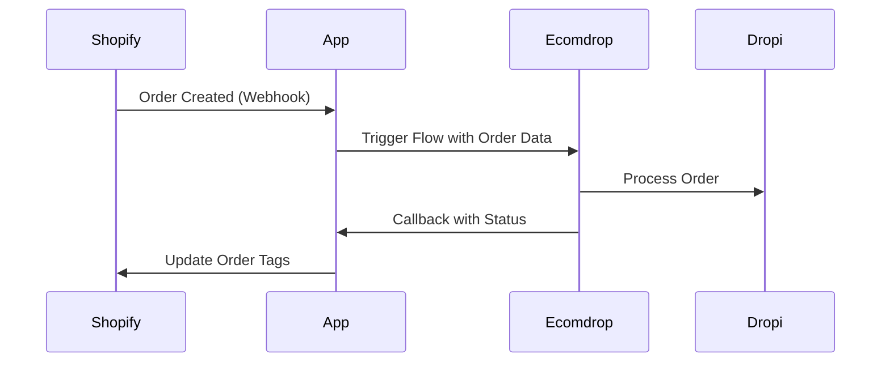

## Introduction

The Ecomdrop IA Connector provides a set of internal API endpoints for managing product synchronization, order processing, and integration workflows between Shopify stores and Ecomdrop/Dropi platforms.

All API endpoints are built using Remix/React Router conventions and require proper Shopify authentication except where explicitly noted.

## Base URL

```
https://your-app-domain.com
```

The base URL is configured via the `SHOPIFY_APP_URL` environment variable during app installation.

## API Architecture

### Authentication Patterns

The API uses three authentication methods depending on the endpoint type:

1. **Shopify Admin API Authentication** - For admin-facing endpoints (`/api/*`)
2. **Webhook Authentication** - For Shopify webhook handlers (`/webhooks/*`)
3. **External API Key Authentication** - For callback endpoints (`/api/ecomdrop/callback`)

See the [Authentication](/api/authentication) page for detailed implementation.

### Request/Response Format

#### Content Type

All API endpoints accept and return JSON unless specified otherwise:

```http
Content-Type: application/json
```

Some endpoints accept `multipart/form-data` for product import operations.

#### Standard Response Structure

Successful responses follow this pattern:

```json
{
  "success": true,
  "data": { ... },
  "message": "Operation completed successfully"
}
```

Error responses:

```json
{
  "success": false,
  "error": "Error message describing what went wrong"
}
```

## API Endpoints

### Product Management

<ParamField path="/api/shopify/products" method="GET">
  Fetch all products from the authenticated Shopify store.
  
  **Authentication:** Shopify Admin API
  
  **Response:**
  ```json
  {
    "success": true,
    "products": [
      {
        "id": "gid://shopify/Product/123",
        "title": "Product Name",
        "handle": "product-handle",
        "status": "ACTIVE",
        "featuredImage": {
          "url": "https://...",
          "altText": "..."
        },
        "variants": [...]
      }
    ]
  }
  ```
</ParamField>

<ParamField path="/api/dropi/products" method="GET">
  Fetch products from Dropi marketplace.
  
  **Authentication:** Shopify Admin API + Dropi Token
  
  **Query Parameters:**
  - `pageSize` (number): Items per page (default: 50)
  - `startData` (number): Pagination offset (default: 0)
  - `keywords` (string): Search query
  - `privated_product` (boolean): Show private products
  - `favorite` (boolean): Show favorited products
  
  **Response:**
  ```json
  {
    "products": [...],
    "total": 150,
    "pageSize": 50,
    "startData": 0
  }
  ```
</ParamField>

<ParamField path="/api/products/import" method="POST">
  Link a Dropi product with a Shopify product.
  
  **Authentication:** Shopify Admin API
  
  **Request Body (FormData):**
  - `dropiProductId`: Dropi product identifier
  - `dropiProductData`: JSON string of product data
  - `shopifyProductId`: Shopify product GID
  - `dropiVariations`: JSON array of variations
  - `variantAssociations`: JSON array of mappings
  - `saveDropiName`: Boolean to sync name
  - `saveDropiDescription`: Boolean to sync description
  - `useSuggestedBarcode`: Boolean for barcode handling
  - `saveDropiImages`: Boolean to import images
  
  **Response:**
  ```json
  {
    "success": true,
    "association": {
      "id": "...",
      "dropiProductId": "...",
      "shopifyProductId": "...",
      "importType": "link"
    },
    "message": "Producto sincronizado exitosamente"
  }
  ```
</ParamField>

<ParamField path="/api/products/association/delete" method="POST">
  Remove a product association between Dropi and Shopify.
  
  **Request Body (FormData):**
  - `associationId`: Association record ID
  
  **Response:**
  ```json
  {
    "success": true,
    "message": "Asociación eliminada exitosamente",
    "associationId": "..."
  }
  ```
</ParamField>

### Order Management

<ParamField path="/api/orders/poll" method="GET">
  Retrieve recent orders from Shopify for manual polling.
  
  **Authentication:** Shopify Admin API
  
  **Response:**
  ```json
  {
    "success": true,
    "orders": [...],
    "count": 10
  }
  ```
  
  Returns the 10 most recent orders with full line items, customer, and shipping information.
</ParamField>

### Integration Configuration

<ParamField path="/api/integrations/dropi/save" method="POST">
  Save or update Dropi integration settings.
  
  **Request Body (FormData):**
  - `store_name`: Dropi store name
  - `country`: Country code (CO, EC, CL, GT, MX, PA, PE, PY)
  - `dropi_token`: Dropi API integration token
  
  **Response:**
  ```json
  {
    "success": true,
    "configuration": {
      "shop": "store.myshopify.com",
      "dropiStoreName": "...",
      "dropiCountry": "CO",
      "dropiToken": "..."
    }
  }
  ```
</ParamField>

### Webhook Callbacks

<ParamField path="/api/ecomdrop/callback" method="POST">
  Receive order processing completion notifications from Ecomdrop.
  
  **Authentication:** API Key (X-ACCESS-TOKEN or in payload)
  
  **Request Body:**
  ```json
  {
    "apiKey": "ecomdrop_api_key",
    "orderName": "#1014",
    "orderId": "gid://shopify/Order/123",
    "shop": "store.myshopify.com",
    "status": "success",
    "tag": "ecomdrop-processed"
  }
  ```
  
  **Response:**
  ```json
  {
    "success": true,
    "message": "Tags added successfully: ecomdrop-processed",
    "orderId": "gid://shopify/Order/123",
    "tags": ["ecomdrop-processed"]
  }
  ```
</ParamField>

## Error Handling

### HTTP Status Codes

| Code | Description |
|------|-------------|
| `200` | Success |
| `400` | Bad Request - Invalid parameters |
| `401` | Unauthorized - Missing or invalid authentication |
| `403` | Forbidden - Valid auth but insufficient permissions |
| `404` | Not Found - Resource does not exist |
| `405` | Method Not Allowed |
| `500` | Internal Server Error |

### Common Error Scenarios

<Warning>
  **Session Errors**: All authenticated endpoints return `401` with `"No shop session found"` if the Shopify session is invalid or expired.
</Warning>

<Warning>
  **Missing Configuration**: Integration endpoints return `400` when required API keys or tokens are not configured.
</Warning>

<Note>
  **Protected Data Access**: Some endpoints may return `403` if the app hasn't been approved for accessing protected customer data by Shopify.
</Note>

## Rate Limiting

The app implements caching mechanisms to prevent rate limiting:

- **Ecomdrop Flows**: Cached for 60 seconds
- **Shopify API**: Subject to Shopify's native rate limits (2 requests/second for REST, 1000 points/second for GraphQL)

## Versioning

The API uses Shopify API version `2025-10` (October 2025). This is configured in `shopify.server.ts`:

```typescript
apiVersion: ApiVersion.October25
```

<Note>
  API version updates should be coordinated with Shopify's release schedule and deprecation notices.
</Note>

## GraphQL vs REST

The app primarily uses Shopify's **GraphQL Admin API** for all operations:

- Product queries and mutations
- Order queries
- Customer data access
- Variant management

REST API is only used for:

- Legacy webhook processing (if configured)
- Specific endpoints not yet available in GraphQL

## Data Flow



## Next Steps

<CardGroup cols={2}>
  <Card title="Authentication" icon="lock" href="/api/authentication">
    Learn about OAuth flow and session management
  </Card>
  <Card title="Webhooks" icon="webhook" href="/api/webhooks">
    Configure webhook handlers for events
  </Card>
</CardGroup>
