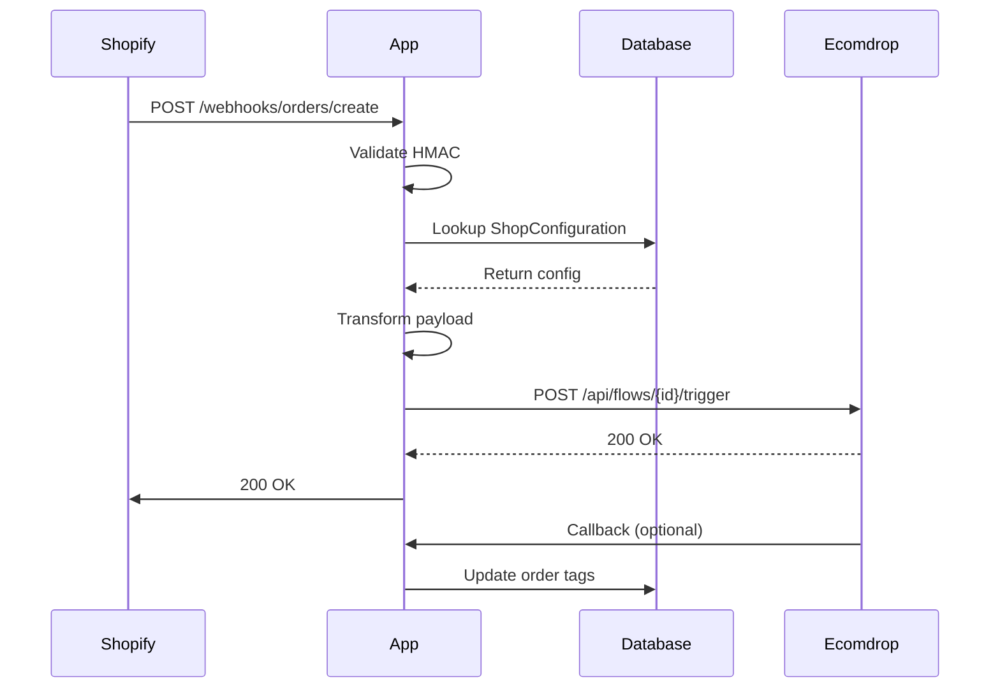

## Overview

Webhooks enable real-time communication between Shopify and the Ecomdrop IA Connector. When specific events occur in your Shopify store, webhooks automatically notify the app, which then triggers configured Ecomdrop flows.

## Webhook Types

The app registers and handles four webhook topics:

### 1. Orders Created (ORDERS_CREATE)

**Purpose**: Triggers when a new order is placed in your store

**Endpoint**: `/webhooks/orders/create`

**Trigger Condition**: Customer completes checkout and order is created

**Source File**: `app/routes/webhooks.orders.create.tsx`

<Accordion title="Event Flow">
  1. Customer completes purchase in Shopify
  2. Shopify sends `ORDERS_CREATE` webhook (GraphQL format)
  3. App validates store configuration
  4. If `nuevoPedidoFlowId` is configured, app formats order data
  5. App calls Ecomdrop API to trigger the assigned flow
  6. Returns 200 OK to Shopify (prevents retries)
</Accordion>

### 2. Draft Orders Created (DRAFT_ORDERS_CREATE)

**Purpose**: Triggers when a draft order is created (abandoned cart scenario)

**Endpoint**: `/webhooks/draft_orders/create`

**Trigger Condition**: Draft order created manually or via checkout abandonment

**Source File**: `app/routes/webhooks.draft_orders.create.tsx`

<Accordion title="Event Flow">
  1. Draft order is created in Shopify
  2. Shopify sends `DRAFT_ORDERS_CREATE` webhook
  3. App retrieves store configuration
  4. If `carritoAbandonadoFlowId` is configured, app processes draft order
  5. App triggers Ecomdrop abandoned cart flow
  6. Returns 200 OK to Shopify
</Accordion>

<Warning>
  Draft order webhooks fire for ALL draft orders, not just abandoned carts. Ensure your flow logic accounts for this.
</Warning>

### 3. App Uninstalled (APP_UNINSTALLED)

**Purpose**: Cleanup when merchant uninstalls the app

**Endpoint**: `/webhooks/app/uninstalled`

**Source File**: `app/routes/webhooks.app.uninstalled.tsx`

<Accordion title="Cleanup Process">
  The webhook handler deletes all store data:
  
  - **Sessions** (`db.session.deleteMany`)
  - **Shop Configuration** (`db.shopConfiguration.deleteMany`)
  - **Product Associations** (`db.productAssociation.deleteMany`)
  - **AI Configuration** (`db.aIConfiguration.deleteMany`)
  
  <Note>
    This ensures GDPR compliance and prevents orphaned data.
  </Note>
</Accordion>

### 4. App Scopes Updated (APP_SCOPES_UPDATE)

**Purpose**: Updates session when app permissions change

**Endpoint**: `/webhooks/app/scopes_update`

**Source File**: `app/routes/webhooks.app.scopes_update.tsx`

<Accordion title="Update Process">
  When Shopify notifies of scope changes:
  
  1. Webhook receives new scopes in `payload.current`
  2. App updates session in database:
     ```typescript
     await db.session.update({
       where: { id: session.id },
       data: { scope: current.toString() }
     });
     ```
  3. Returns 200 OK
</Accordion>

## Webhook Security

Shopify webhooks use HMAC signatures to verify authenticity.

### Authentication Flow

<Steps>
  <Step title="Shopify Signs Request">
    Shopify generates HMAC-SHA256 signature using your app's client secret
  </Step>
  
  <Step title="App Validates Signature">
    The `authenticate.webhook(request)` method verifies:
    - HMAC signature in headers
    - Request origin from Shopify
    - Timestamp freshness (prevents replay attacks)
  </Step>
  
  <Step title="Process or Reject">
    Valid webhooks are processed; invalid ones are rejected with 401
  </Step>
</Steps>

<Note>
  The Shopify App Bridge handles webhook authentication automatically. You don't need to implement manual verification.
</Note>

### Security Best Practices

<AccordionGroup>
  <Accordion title="Always Verify HMAC">
    Never process webhook data without validating the HMAC signature. This prevents malicious requests from triggering flows.
  </Accordion>
  
  <Accordion title="Return 200 for All Requests">
    Always return HTTP 200, even on errors. This prevents Shopify from retrying failed webhooks indefinitely.
    
    ```typescript
    try {
      // Process webhook
    } catch (error) {
      console.error(error);
      return new Response("OK", { status: 200 }); // Still return 200
    }
    ```
  </Accordion>
  
  <Accordion title="Secure API Keys">
    Store Ecomdrop API keys encrypted in the database. Never log them in plaintext.
  </Accordion>
  
  <Accordion title="Validate Payload Structure">
    Check that required fields exist before accessing them:
    
    ```typescript
    const order = (payload as any).order || payload;
    if (!order || !order.id) {
      console.error("Invalid order payload");
      return new Response("OK", { status: 200 });
    }
    ```
  </Accordion>
</AccordionGroup>

## Webhook Payload Examples

### Orders Create Payload

```json
{
  "order": {
    "id": "gid://shopify/Order/5123456789012",
    "name": "#1001",
    "createdAt": "2024-01-15T10:30:00Z",
    "totalPriceSet": {
      "shopMoney": {
        "amount": "149.99",
        "currencyCode": "USD"
      }
    },
    "customer": {
      "id": "gid://shopify/Customer/4123456789012",
      "email": "customer@example.com",
      "firstName": "John",
      "lastName": "Doe",
      "phone": "+1234567890"
    },
    "lineItems": {
      "edges": [
        {
          "node": {
            "id": "gid://shopify/LineItem/123",
            "title": "Product Name",
            "quantity": 2,
            "originalUnitPrice": {
              "amount": "74.99"
            },
            "variant": {
              "id": "gid://shopify/ProductVariant/456",
              "sku": "PROD-001"
            }
          }
        }
      ]
    },
    "shippingAddress": {
      "firstName": "John",
      "lastName": "Doe",
      "address1": "123 Main St",
      "city": "New York",
      "province": "NY",
      "country": "United States",
      "zip": "10001",
      "phone": "+1234567890"
    }
  }
}
```

### Draft Orders Create Payload

```json
{
  "draftOrder": {
    "id": "gid://shopify/DraftOrder/789",
    "name": "#D1",
    "createdAt": "2024-01-15T11:00:00Z",
    "totalPrice": {
      "amount": "199.99"
    },
    "currencyCode": "USD",
    "customer": {
      "id": "gid://shopify/Customer/456",
      "email": "customer@example.com",
      "firstName": "Jane",
      "lastName": "Smith"
    },
    "lineItems": {
      "edges": [
        {
          "node": {
            "title": "Another Product",
            "quantity": 1,
            "originalUnitPrice": {
              "amount": "199.99"
            }
          }
        }
      ]
    },
    "email": "customer@example.com"
  }
}
```

## Webhook Processing

### Data Transformation

The app transforms Shopify's GraphQL webhook format into a simplified structure for Ecomdrop:

<Steps>
  <Step title="Extract Core Fields">
    Maps order ID, name, timestamps, and financial data
  </Step>
  
  <Step title="Format Customer Data">
    Extracts customer email, name, phone, and purchase history
  </Step>
  
  <Step title="Parse Line Items">
    Transforms nested GraphQL edges into flat array:
    
    ```typescript
    lineItems: order.lineItems?.edges?.map((edge: any) => {
      const item = edge.node;
      return {
        id: item.id,
        title: item.title,
        quantity: item.quantity,
        price: item.originalUnitPrice?.amount,
        sku: item.variant?.sku
      };
    })
    ```
  </Step>
  
  <Step title="Add Metadata">
    Includes shop domain, event type, and callback URLs
  </Step>
</Steps>

### Error Handling

<Accordion title="Configuration Missing">
  If no API key or flow ID is configured:
  
  ```typescript
  if (!configuration?.ecomdropApiKey) {
    console.log(`⚠️ No API Key configured for ${shop}`);
    return new Response("OK", { status: 200 });
  }
  ```
  
  App logs warning and returns 200 (no error for Shopify).
</Accordion>

<Accordion title="API Call Failure">
  If Ecomdrop API call fails:
  
  ```typescript
  if (!result.success) {
    console.error(`❌ Failed to trigger flow: ${result.error}`);
    // Tag order with 'ecomdrop-error' for tracking
    await updateOrderTags({
      session,
      orderId: order.id,
      tags: ["ecomdrop-error"]
    });
  }
  ```
  
  Order is tagged for manual review.
</Accordion>

<Accordion title="Malformed Payload">
  If webhook payload is invalid:
  
  ```typescript
  try {
    const order = (payload as any).order || payload;
    // Process order
  } catch (error) {
    console.error(`❌ Error processing webhook:`, error);
    return new Response("OK", { status: 200 });
  }
  ```
  
  Logs error and returns 200 to prevent retries.
</Accordion>

## Testing Webhooks

### Using Shopify CLI

<Steps>
  <Step title="Start Development Server">
    ```bash
    npm run dev
    ```
  </Step>
  
  <Step title="Trigger Test Webhook">
    ```bash
    shopify app webhook trigger --topic ORDERS_CREATE
    ```
  </Step>
  
  <Step title="Review Logs">
    Check console output for webhook processing:
    
    ```
    📦 Received ORDERS_CREATE webhook for shop.myshopify.com
    🔍 Looking for configuration with shop: shop.myshopify.com
    ```
  </Step>
</Steps>

<Warning>
  CLI test webhooks use a generic shop domain (`shop.myshopify.com`). Your configuration must exist for this test domain, or webhook will skip processing.
</Warning>

### Testing in Production

<Steps>
  <Step title="Create Real Order">
    Place a test order in your Shopify store using Bogus Gateway
  </Step>
  
  <Step title="Monitor Webhook Delivery">
    In Shopify Admin:
    - Go to Settings > Notifications > Webhooks
    - Click on the webhook subscription
    - View delivery history and response codes
  </Step>
  
  <Step title="Check App Logs">
    Review your app's server logs for processing details
  </Step>
  
  <Step title="Verify in Ecomdrop">
    Confirm the flow was triggered in your Ecomdrop panel
  </Step>
</Steps>

### Manual Webhook Replay

You can replay failed webhooks from Shopify Admin:

1. Go to Settings > Notifications > Webhooks
2. Click the failed webhook subscription
3. Find the failed delivery
4. Click "Resend" to replay the webhook

<Info>
  Useful for testing fixes after resolving configuration issues.
</Info>

## Webhook Lifecycle



## Troubleshooting

<AccordionGroup>
  <Accordion title="Webhooks Not Firing">
    **Symptoms**: No webhook logs when creating orders
    
    **Solutions**:
    1. Verify webhooks are registered in Shopify Admin > Settings > Notifications
    2. Check webhook subscriptions in app configuration
    3. Ensure app is deployed and publicly accessible
    4. Review Shopify webhook delivery logs for errors
    5. Confirm the app has required API scopes
  </Accordion>
  
  <Accordion title="Webhooks Received But Not Processing">
    **Symptoms**: Logs show webhook received but flow doesn't trigger
    
    **Solutions**:
    1. Check that Ecomdrop API key is configured
    2. Verify flow ID is assigned for the event type
    3. Review logs for configuration lookup failures
    4. Ensure shop domain matches configuration record
    5. Test Ecomdrop API connectivity manually
  </Accordion>
  
  <Accordion title="Duplicate Webhook Deliveries">
    **Symptoms**: Flow triggers multiple times for single order
    
    **Solutions**:
    1. Check Shopify webhook history for duplicates
    2. Verify app isn't deployed multiple times
    3. Ensure webhook handler is idempotent
    4. Review Ecomdrop for duplicate flow executions
    5. Check for webhook replay actions in Shopify
  </Accordion>
  
  <Accordion title="Webhook Payload Errors">
    **Symptoms**: App logs show missing or malformed data
    
    **Solutions**:
    1. Log full payload to inspect structure
    2. Verify GraphQL vs REST format expectations
    3. Check Shopify API version compatibility
    4. Handle optional fields with safe navigation (`?.`)
    5. Add validation for required fields
  </Accordion>
</AccordionGroup>

## Monitoring Webhooks

### Key Metrics to Track

<CardGroup cols={2}>
  <Card title="Delivery Success Rate" icon="check">
    Monitor percentage of webhooks returning 200 OK
  </Card>
  
  <Card title="Processing Time" icon="clock">
    Track latency from webhook receipt to Ecomdrop API call
  </Card>
  
  <Card title="Flow Trigger Rate" icon="rocket">
    Compare webhooks received vs flows actually triggered
  </Card>
  
  <Card title="Error Tags" icon="exclamation">
    Count orders tagged with `ecomdrop-error`
  </Card>
</CardGroup>

### Logging Best Practices

The app uses structured logging with emojis for easy filtering:

- `📦` - Order webhook received
- `📝` - Draft order webhook received
- `🔍` - Configuration lookup
- `✅` - Success
- `❌` - Error
- `⚠️` - Warning
- `🚀` - Flow trigger

Search logs using these emojis to quickly find relevant events.

## API Reference

### Webhook Endpoints

| Endpoint | Method | Topic | Purpose |
|----------|--------|-------|----------|
| `/webhooks/orders/create` | POST | ORDERS_CREATE | New order processing |
| `/webhooks/draft_orders/create` | POST | DRAFT_ORDERS_CREATE | Abandoned cart flow |
| `/webhooks/app/uninstalled` | POST | APP_UNINSTALLED | Data cleanup |
| `/webhooks/app/scopes_update` | POST | APP_SCOPES_UPDATE | Permission sync |

### Webhook Authentication

All webhooks must include Shopify HMAC headers:

```
X-Shopify-Hmac-Sha256: <signature>
X-Shopify-Shop-Domain: <shop>
X-Shopify-Topic: <topic>
X-Shopify-API-Version: <version>
```

## Next Steps

<CardGroup cols={2}>
  <Card title="Store Settings" icon="gear" href="/configuration/store-settings">
    Configure API keys and integration settings
  </Card>
  <Card title="Flow Management" icon="diagram-project" href="/configuration/flow-management">
    Set up and test Ecomdrop flows
  </Card>
</CardGroup>