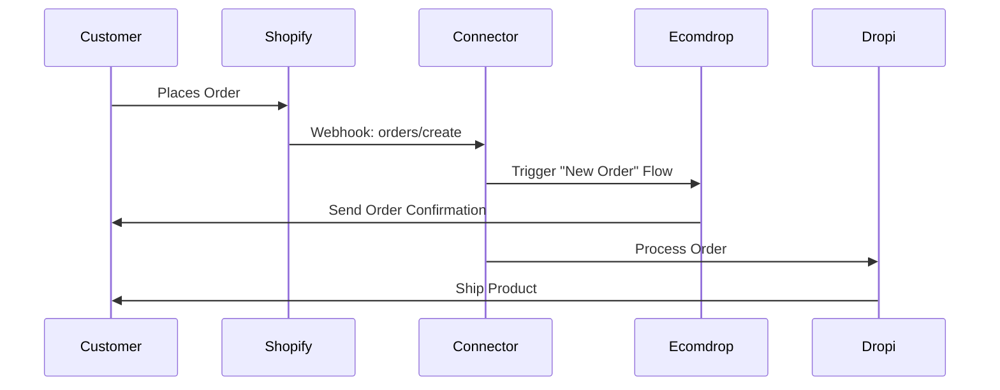

# Welcome to Ecomdrop IA Connector

Ecomdrop IA Connector is a modern Shopify app built with React Router that seamlessly connects Shopify stores with **Ecomdrop** and **Dropi** platforms. It features AI-powered configuration for customer support and automated order processing.

<CardGroup cols={2}>
  <Card title="AI-Powered Support" icon="robot">
    Configure an intelligent AI assistant to handle customer inquiries automatically
  </Card>
  <Card title="Product Sync" icon="box">
    Import and sync products between Shopify, Ecomdrop, and Dropi seamlessly
  </Card>
  <Card title="Order Automation" icon="shopping-cart">
    Automated order processing and flow management for efficient operations
  </Card>
  <Card title="Theme Management" icon="palette">
    Install and manage Shopify themes programmatically from Git repositories
  </Card>
</CardGroup>

## What is Ecomdrop IA Connector?

Ecomdrop IA Connector is a comprehensive integration solution that bridges the gap between your Shopify store and two powerful platforms:

- **Ecomdrop**: An AI-powered customer engagement platform that automates customer support and marketing workflows
- **Dropi**: A dropshipping platform that provides access to products from multiple warehouses across Latin America

By connecting these platforms, you can:

<AccordionGroup>
  <Accordion title="Automate Customer Support">
    Configure an AI assistant that can answer customer questions about products, orders, shipping, and company policies. The AI is fully customizable with your company information, FAQs, and business rules.
  </Accordion>
  
  <Accordion title="Streamline Product Management">
    Import products from Dropi's catalog directly into your Shopify store. Associate Dropi products with your Shopify products to enable automatic order fulfillment.
  </Accordion>
  
  <Accordion title="Process Orders Automatically">
    When a customer places an order on your Shopify store, the app can automatically trigger workflows in Ecomdrop to send notifications, process payments, and coordinate with Dropi for fulfillment.
  </Accordion>
  
  <Accordion title="Manage Abandoned Carts">
    Set up automated workflows to recover abandoned carts by triggering Ecomdrop flows that can send personalized messages to potential customers.
  </Accordion>
</AccordionGroup>

## Who is it for?

Ecomdrop IA Connector is designed for:

<CardGroup cols={2}>
  <Card title="Shopify Store Owners" icon="store">
    E-commerce merchants who want to automate customer support and streamline operations
  </Card>
  <Card title="Dropshippers" icon="truck">
    Businesses using Dropi for product sourcing and fulfillment across Latin America
  </Card>
  <Card title="Marketing Teams" icon="megaphone">
    Teams looking to automate customer engagement and recover abandoned carts
  </Card>
  <Card title="Developers" icon="code">
    Technical teams managing Shopify apps with modern technologies
  </Card>
</CardGroup>

## Key Benefits

### Unified Platform Integration

Manage all your integrations from a single, beautiful dashboard embedded directly in your Shopify admin.

### Real-Time Synchronization

Changes in your Shopify store automatically trigger events in Ecomdrop and Dropi, ensuring data consistency.

### Scalable Architecture

Built on modern technologies with MySQL database, Docker containerization, and production-ready infrastructure.

### Customizable AI Assistant

Train your AI assistant with:

- Company name and description
- Payment methods
- Shipping policies
- Frequently asked questions
- Pre-sale and post-sale FAQs
- Business rules and guidelines
- Custom notification settings

## How It Works

<Steps>
  <Step title="Install the App">
    Install Ecomdrop IA Connector from the Shopify App Store or deploy it to your own infrastructure.
  </Step>
  
  <Step title="Connect Ecomdrop">
    Enter your Ecomdrop API key to connect your account. Once connected, you can select which flows to trigger for new orders and abandoned carts.
  </Step>
  
  <Step title="Configure Dropi">
    Enter your Dropi credentials (store name, country, and token) to enable product syncing and order fulfillment.
  </Step>
  
  <Step title="Set Up AI Assistant">
    Configure your AI assistant with company information, FAQs, policies, and notification settings.
  </Step>
  
  <Step title="Import Products">
    Browse Dropi's product catalog and import products to your Shopify store. Map product variants for accurate inventory tracking.
  </Step>
  
  <Step title="Go Live">
    Your store is now connected! Orders will automatically flow through the system, and your AI assistant is ready to help customers.
  </Step>
</Steps>

## Quick Example

Here's what happens when a customer places an order:

<Note>
  **Automatic and Seamless**: All these steps happen automatically without any manual intervention required.
</Note>

## Technology Stack

Ecomdrop IA Connector is built with modern, production-ready technologies:

- **React Router v7** for routing and server-side rendering
- **TypeScript** for type safety
- **Prisma ORM** with MySQL for reliable data storage
- **Shopify App Bridge** for embedded app experience
- **shadcn/ui** and Tailwind CSS for beautiful UI
- **Docker** for containerization and easy deployment

<Tip>
  The app is fully open-source and can be customized to fit your specific business needs.
</Tip>

## Getting Started

Ready to connect your store? Check out the [Features](/features) page to learn about all capabilities, or jump straight to the [Architecture](/architecture) section to understand how everything works together.

<CardGroup cols={2}>
  <Card title="Explore Features" icon="sparkles" href="/features">
    Discover all the powerful features available
  </Card>
  <Card title="View Architecture" icon="diagram-project" href="/architecture">
    Understand the technical architecture
  </Card>
</CardGroup>
